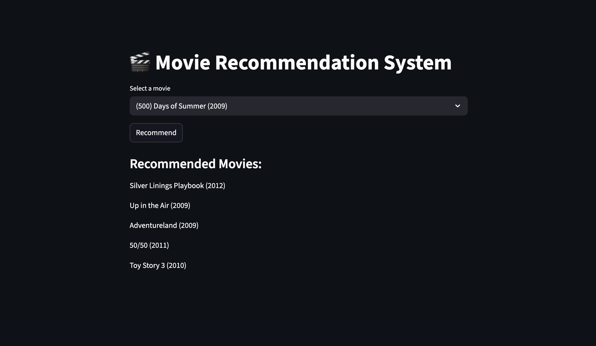

# Movie Recommendation System

A machine learning project that recommends movies based on user ratings using cosine similarity.

## Features
- Movie recommendation using collaborative filtering
- Cosine similarity algorithm
- Interactive web interface with Streamlit

## Dataset
MovieLens dataset containing user ratings for movies.

## Tech Stack
- Python
- Pandas
- Scikit-learn
- Streamlit

## How to Run

Install dependencies:

pip install pandas numpy scikit-learn streamlit

Run the app:

streamlit run app.py

## App Preview

